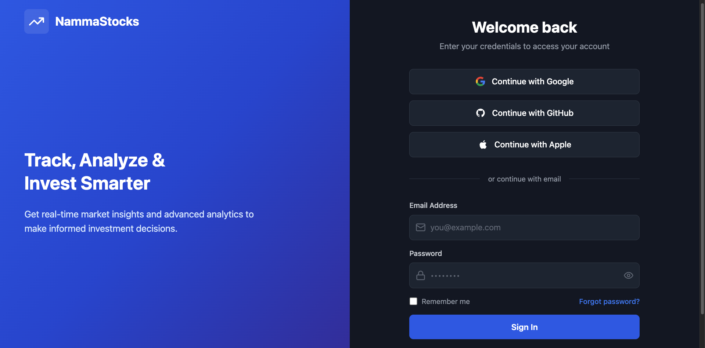
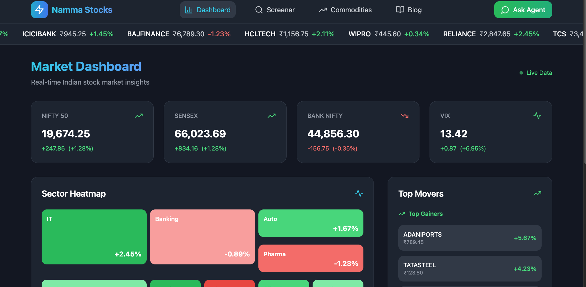
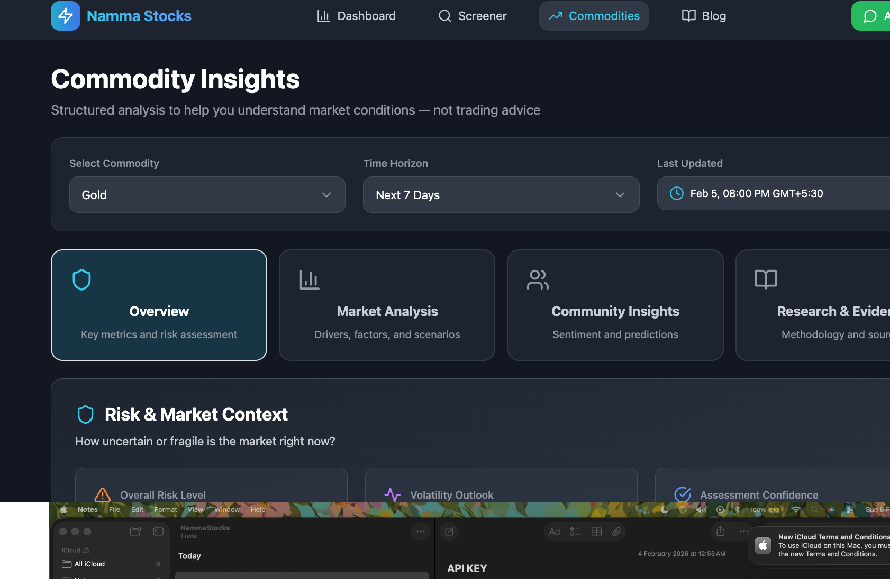
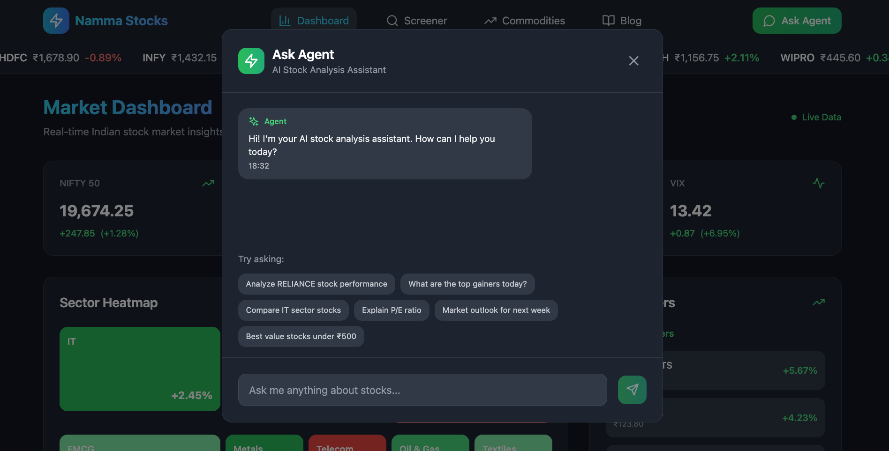

# Commodity Market Insights Platform

## Problem Statement

Commodity prices move sharply during uncertainty (geopolitics, policy shifts, supply disruptions), but the information driving these moves is **scattered across news, macro releases, and market data**. Retail and early-stage investors lack a reliable way to connect:

- **What happened** → news/events
- **Which commodities are impacted** → market exposure  
- **How risky is the next period** → uncertainty quantification

## Solution

A data-driven platform that connects real-world events to commodity market movements, providing:

✅ **Evidence-backed driver analysis** — not speculation  
✅ **Risk signals** — volatility forecasts and uncertainty bands  
✅ **Scenario planning** — "if X escalates, then Y likely happens"  
✅ **Real-time insights** — daily updates with citations and sources  

---

## Key Features

### 1. **Market Driver Attribution**
- Top 3–7 most relevant events/news per commodity
- Why each driver matters with cited sources
- Connects geopolitical, policy, and supply events to prices

### 2. **Regime Classification**
- Automatic labeling: "geopolitical shock", "demand slowdown", "policy uncertainty", "supply disruption"
- Understand what type of uncertainty is driving the market

### 3. **Risk Indicators**
- Volatility forecasts (next 1–7 days)
- Uncertainty bands for decision-making
- Outperforms simple rolling volatility baseline

### 4. **Scenario Analysis**
- "If X escalates → pressure on Y"
- Clearly framed as scenarios, not guarantees
- Helps with hedging and risk management

### 5. **Real-Time Dashboard**
- Live commodity prices (Gold, Silver, Brent/WTI Oil)
- Interactive charts and heatmaps
- Filter by regime, timeframe, and risk levels

---

## Platform Pages

### Dashboard
**Overview of all monitored commodities with key metrics and risk signals**
- Real-time price movements
- Risk indicator heatmap
- Top drivers widget
- Market regime labels

### Commodity Insights
**Deep-dive analysis for individual commodities**
- Historical driver timeline
- Current regime analysis
- Volatility forecast chart
- Scenario impact assessment
- Related news feed with citations

### Screener
**Filter and identify opportunities based on risk/opportunity**
- Filter by regime type
- Volatility bands
- Alert on significant regime changes
- Compare multiple commodities

### Blog
**Educational content and market commentary**
- Weekly market recaps
- Driver analysis deep-dives
- Risk management guides
- Historical case studies

---

## Success Metrics

### 1. **Explanation Quality**
- Human evaluation: relevance, evidence quality, no hallucinations
- Click-through rate on cited sources
- User feedback on actionability

### 2. **Risk Signal Accuracy**
- Volatility forecast vs actual (out-of-sample)
- Outperforms rolling volatility baseline
- Calibration of uncertainty bands

### 3. **User Engagement**
- DAU/WAU on insights pages
- Driver citations followed
- Scenario notes saved/shared
- Alert subscriptions

---

## Tech Stack

### Backend
- **Framework**: FastAPI (Python)
- **Architecture**: Domain-Driven Design (DDD)
- **Database**: PostgreSQL (async)
- **Domains**: Items (commodities), Dashboard (aggregations), External (news API integration)

### Frontend
- **Framework**: React + TypeScript
- **Build Tool**: Vite
- **Styling**: Tailwind CSS
- **State**: React Hooks
- **Charts**: Candlestick charts, heatmaps, time-series

---

## Installation & Setup

### Prerequisites
- Python 3.10+
- Node.js 16+
- PostgreSQL 13+

---

## Screenshots & Demos

### User Flow

#### 1. Login Page

*Secure authentication to access market insights*

#### 2. Dashboard Overview

*Real-time commodity prices, risk indicators, and market overview*

#### 3. Commodities Insights

*Deep-dive analysis for individual commodities with driver attribution*

#### 4. AI Agent Assistant

*Interactive AI assistant for market questions and scenario analysis*

---

## Support & Feedback

For issues, feature requests, or feedback, please open an issue in the repository.

---

**Built with ❤️ for commodity traders and investors seeking clarity in uncertain markets.**
